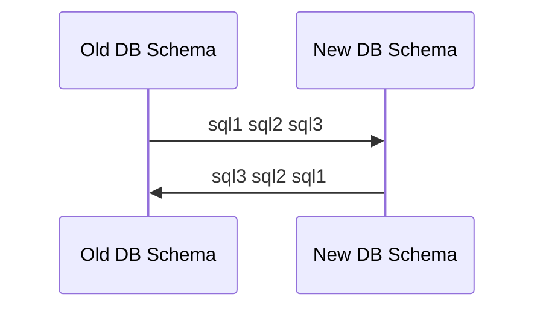

## Setting up and migrating db schema with make

```shell
#run postgres15 docker image
make postgres

#create db: simple_bank
make createdb

#to drop db
make dropdb

#create migration setup files using
migrate create -ext sql -dir db/migration -seq init_schema

#populate schema migration sql files both up and down, refer to golang-migrate util section.

#to migrate schemas into db
make migrateup

#to revert the migration of schemas
make migratedown
```
[SimpleBankGo Makefile](../Makefile)

## golang-migrate
Helps managing migration of db schemas  
UP/DOWN Migration  
Migration process must be in reverse order


### Example
```shell
#create migration .sql files for schemas.
migrate create -ext sql -dir db/migration -seq init_schema
```

## Setting up and migrating with docker cli

### Usage

```shell
docker run --name {$name} -p {HOST_PORT:CONT_PORT} -e {ENV_VAR}={$VALUE}  
docker logs {$name | $id}  
docker exec -it {$name} {command}
```

### Example

```shell
#run psql image
docker run --name postgres15 -p 5433:5432 -e POSTGRES_USER=root -e POSTGRES_PASSWORD=secret -d postgres:15-alpine

#exec command in psql container (run psql CLI as User root)
docker exec -it postgres15 psql -U root

#exec command in psql container to enter shell
docker exec -it postgres15 /bin/sh

#inside postgres15 container shell
#to create DB simple_bank
createdb --username=root --owner=root simple_bank
#to drop db simple_bank
dropdb simple_bank
#exit container shell
exit

#alternatively, on host shell
docker exec -it postgres15 createdb --username=root --owner=root simple_bank
docker exec -it postgres15 dropdb simple_bank
```