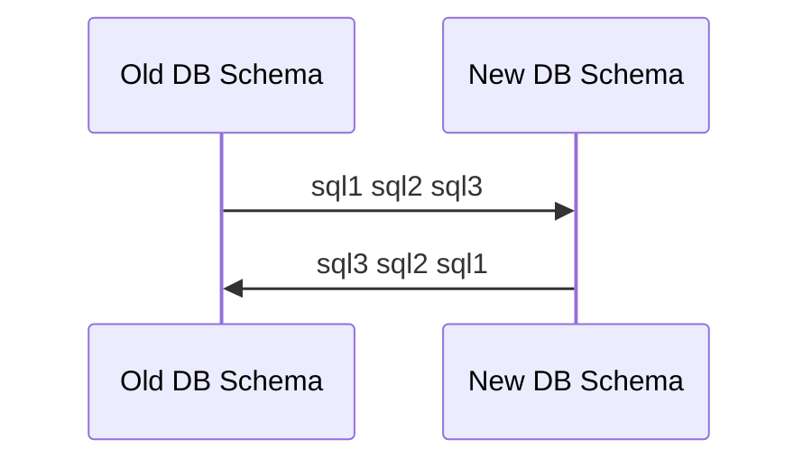

## Docker

run --name {$name} -p {HOST_PORT:CONT_PORT} -e {ENV_VAR}={$VALUE}  
logs {$name | $id}  
exec -it {$name} {command}  

start  
stop  

### PostgresSQL

```shell
#run psql image
docker run --name postgres15 -p 5433:5432 -e POSTGRES_USER=root -e POSTGRES_PASSWORD=secret -d postgres:15-alpine

#exec command in psql container (run psql CLI as User root)
docker exec -it postgres15 psql -U root

#exec command in psql container to enter shell
docker exec -it postgres15 /bin/sh

#inside postgres15 container shell
#create DB simple_bank
createdb --username=root --owner=root simple_bank
#drop db simple_bank
dropdb simple_bank
#exit container shell
exit

#alternatively, on host shell
docker exec -it postgres15 createdb --username=root --owner=root simple_bank
docker exec -it postgres15 dropdb simple_bank
```

## golang-migrate
Helps managing migration of db schemas  
UP/DOWN Migration  
Migration process must be in reverse order


### Example
```shell
#create migration .sql files for schemas.
migrate create -ext sql -dir db/migration -seq init_schema
```